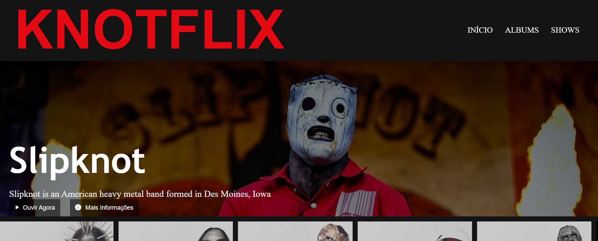

# DIO-netflix-clone
Desafio de código da Digital Innovation One, recriar a interface do Netflix

Utilizando conhecimentos básicos de html, css e js recriei a interface com o tema de uma banda que gosto. 
Criei um player pra ouvir uma música. 
Projeto simples, porém, muito útil para relembrar alguns conceitos.

